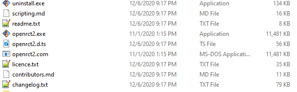
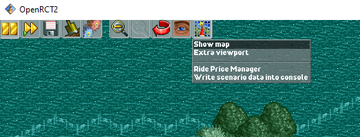
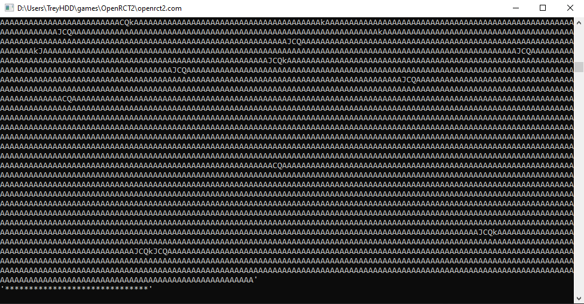
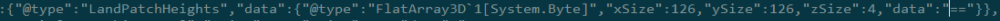
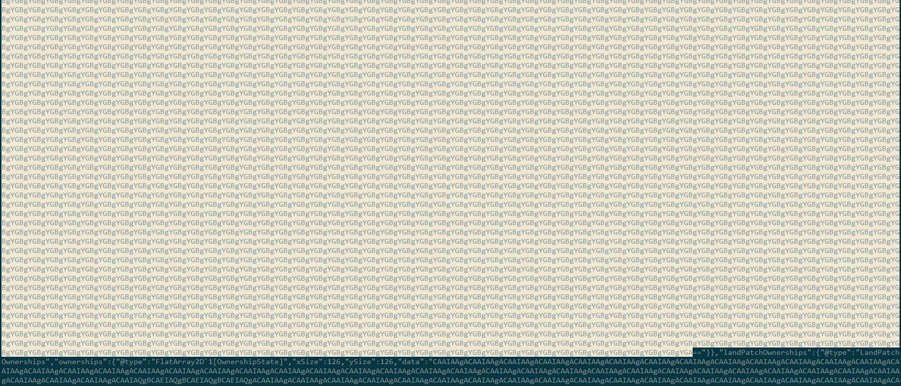
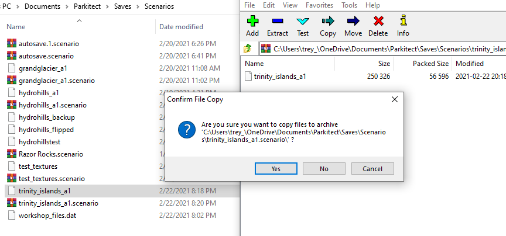
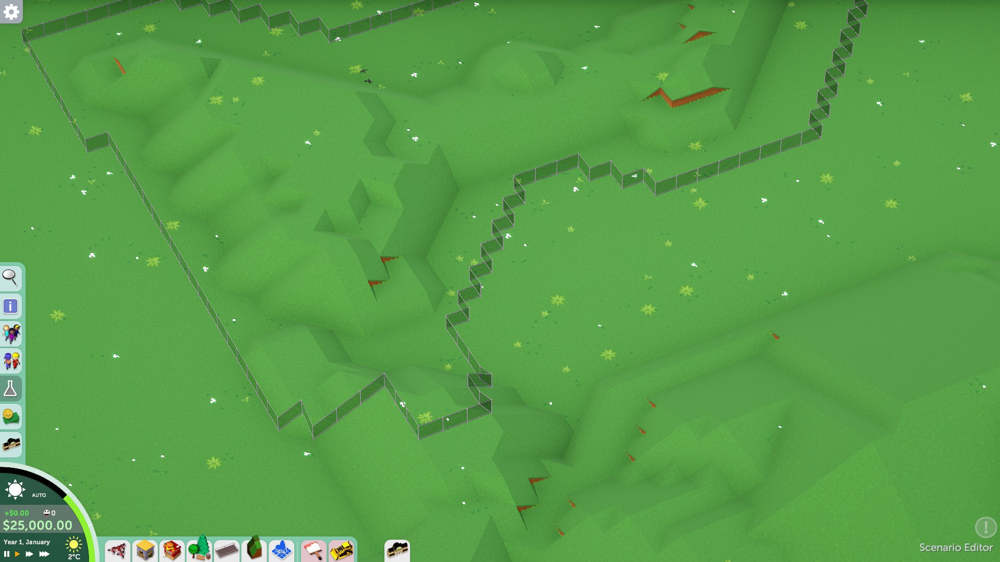

# OpenRCT2-terrain-to-Parkitect
OpenRCT2 plugin to export the scenario's terrain data into Parkitect

Currently exports the height data, land ownership, and terrain types. Tested with OpenRCT2 v0.3.2

This is not very user friendly. Follow these steps. You will need 7zip and preferably Notepad++

TODO: I think the land ownership is bugged

1. Launch OpenRCT2 through "openrct2.com" instead of the .exe so the console opens

2. Open the scenario you want to export the terrain of. Under the map icon, click "Write scenario data into console"
3. Your console should have a bunch of characters in it. Copy the console log to a txt file (Ctrl+A to select all and then Ctrl+C) 
4. Take note of the map size. Most RCT scenarios seem to be 126x126. Create an empty parkitect scenario with that map size. It **must** be the same map size.
  -You cannot save without adding a park entrance and a guest spawner, so I recommend puting it in a corner because you will need to delete it later
  -Save and quit the scenario
5. Go to your Parkitect scenarios folder. Should be in "Documents\Parkitect\Saves\Scenarios". Open the .SCENARIO file with 7zip and extract the file inside that archive. Should just be a single "File" file.
6. Open the file and the exported data file in Notepad++ (Turn on word wrap for sanity's sake). In the parkitect file, Ctrl+F for "landPatchHeights".  \
  -You should see something like "xSize":126,"ySize":126,"zSize":4,"data": \  
  -After "data": is hundreds of characters surrounded by quotation marks. Select them all, then delete. You can double click to quickly select them all  
7. Go to your exported data file. Under "Height Data" is the data parkitect can read. Copy and paste the new data to where the old data was.
  - (Sometimes the data ends in a '==' and double clicking doesn't select those characters, like in the pictures)
8. Right at the end of the height data should be the "landPatchOwnerships" block. Do the same thing for that data
9. Right at the end of the ownership data should be the "LandPatchTerrainTypes" block. Do the same thing for that data.
10. Open the .scenario file in 7zip, drag and drop the edited .file to overwrite the one inside the .scenario archive.  
11. Open the scenario in Parkitect and hope everything works!  
